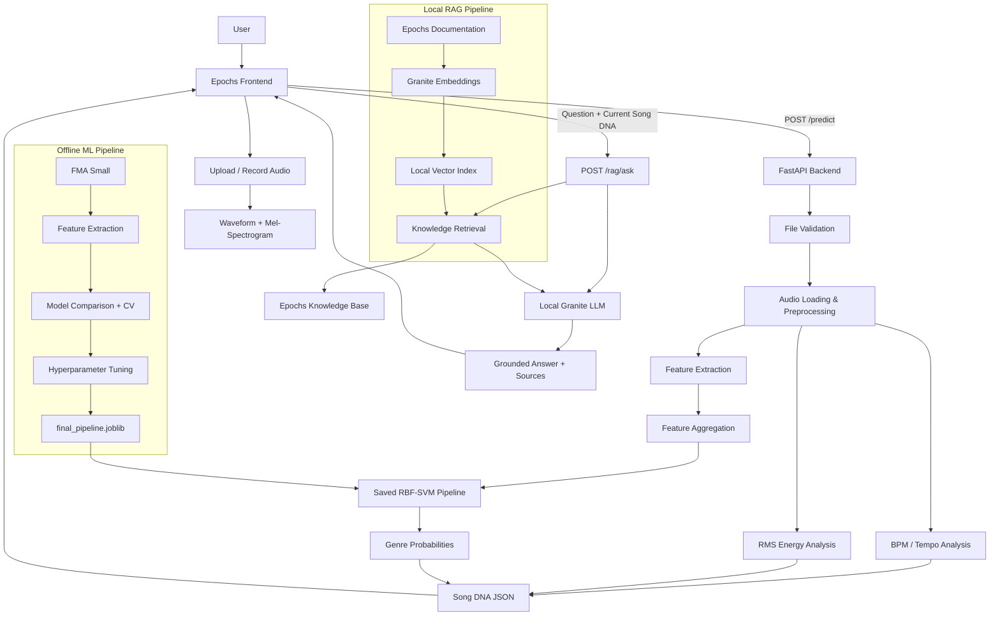

# Epochs --- Music Genre Classification & Song DNA Analyzer

> **Solo ML + Full Stack Development Case Study**

Epochs is an ML-powered music analysis web application that converts an
uploaded or recorded song into a compact **Song DNA** profile.

The system:

-   extracts handcrafted audio features,
-   predicts the most likely music genre,
-   reports genre probabilities,
-   estimates BPM,
-   calculates an RMS-based energy score,
-   visualizes the waveform and Mel-spectrogram,
-   and provides an optional **Ask Epochs** RAG assistant for
    project-specific explanations.

The project uses a traditional machine-learning pipeline rather than a
deep-learning classifier. The final deployed classifier is an
**RBF-kernel Support Vector Machine (SVM)**.

------------------------------------------------------------------------

## Features

### Music Analysis

-   Audio upload with a maximum supported duration of **5 minutes**
-   Live recording with a maximum recording duration of **90 seconds**
-   Audio preprocessing and feature extraction using Librosa
-   61-dimensional handcrafted audio feature representation
-   Genre probability distribution across the supported genres
-   BPM / tempo estimation
-   RMS-based normalized energy measurement
-   Waveform visualization
-   Mel-spectrogram visualization
-   Combined Song DNA result view

### Machine Learning

-   Primary dataset: **FMA Small**
-   8 genre classes
-   8,000 original 30-second tracks
-   7,997 usable rows in the final extracted feature dataset
-   Candidate models include Logistic Regression, KNN, SVM and Random
    Forest
-   Cross-validation and hyperparameter tuning
-   Final selected model: **RBF SVM**
-   Saved model pipeline used by the FastAPI backend

### Ask Epochs --- RAG Assistant

Ask Epochs is a local Retrieval-Augmented Generation layer built
specifically for this project.

It can answer questions about:

-   the Epochs model,
-   feature engineering,
-   dataset,
-   evaluation,
-   limitations,
-   Song DNA interpretation,
-   and the current prediction.

The assistant receives the current Song DNA when available and retrieves
relevant project knowledge before generating its answer.

**Important:** RAG explains the system and its predictions; it does not
retrain, modify, or replace the genre classifier.

------------------------------------------------------------------------

## Final Model Result

The final deployed classifier is an **RBF-kernel SVM** with:

``` text
C = 1
kernel = rbf
gamma = scale
```

Held-out evaluation:

  Metric                  Result
  ----------------- ------------
  Test Accuracy       **47.16%**
  Macro Precision     **46.80%**
  Macro Recall        **48.29%**
  Macro F1            **46.97%**

The final evaluation should be interpreted as a multiclass
genre-classification result on the selected FMA Small evaluation setup,
not as a guarantee that the predicted genre is correct for every song.

------------------------------------------------------------------------

## Architecture



------------------------------------------------------------------------

## End-to-End Flow

``` text
Audio
  ↓
Validation
  ↓
Audio Loading / Preprocessing
  ↓
Feature Extraction
  ↓
Feature Aggregation
  ↓
Saved RBF-SVM Pipeline
  ↓
Genre Probabilities
        ↘
         Song DNA
        ↗
BPM + Energy
  ↓
FastAPI JSON Response
  ↓
Epochs Frontend
```

For Ask Epochs:

``` text
User Question + Current Song DNA
                ↓
            /rag/ask
                ↓
       Retrieve Epochs Knowledge
                ↓
       Local Granite LLM
                ↓
      Grounded Answer + Sources
```

------------------------------------------------------------------------

## Tech Stack

  -------------------------------------------------------------------------
  Layer                   Technology                Purpose
  ----------------------- ------------------------- -----------------------
  Language                Python                    ML, audio processing,
                                                    backend

  Data                    Pandas, NumPy             Data handling

  Audio                   Librosa, SoundFile        Loading, feature
                                                    extraction, BPM and
                                                    spectral analysis

  ML                      Scikit-learn              Models, pipelines, CV,
                                                    tuning and evaluation

  Persistence             Joblib                    Saved ML pipeline

  Backend                 FastAPI                   Prediction and RAG APIs

  Frontend                HTML, CSS, JavaScript     Web interface

  UI                      Bootstrap                 Responsive UI
                                                    components

  RAG embeddings          Ollama                    Local document
                          `granite-embedding:30m`   embeddings

  RAG generation          Ollama `granite4:micro`   Local grounded answers

  Visualization           Matplotlib / Seaborn      EDA and evaluation
                                                    plots

  Development             Jupyter Notebook, VS Code Experiments and
                                                    implementation

  Version Control         Git + GitHub              Source control
  -------------------------------------------------------------------------

------------------------------------------------------------------------

## Repository Structure

``` text
Epochs-Music-Genre-Classifier/
│
├── data/
│   ├── raw/                    # Original dataset archives / audio
│   └── processed/              # Extracted features and processed data
│
├── notebooks/
│   ├── 01_eda.ipynb
│   ├── 02_feature_extraction.ipynb
│   └── 03_model_training.ipynb
│
├── src/
│   ├── audio_processing.py
│   ├── feature_extraction.py
│   ├── train.py
│   └── predict.py
│
├── models/
│   └── final_pipeline.joblib   # Final trained ML pipeline
│
├── backend/
│   ├── main.py                 # FastAPI application
│   └── rag/
│       └── storage/            # Local generated RAG index
│
├── frontend/
│   ├── index.html
│   ├── style.css
│   └── script.js
│
├── results/
│   ├── eda/
│   └── model_evaluation/
│
├── requirements.txt
├── requirements-rag.txt
├── .env.example
├── README.md
└── .gitignore
```

------------------------------------------------------------------------

# Running Epochs Locally

## 1. Clone the repository

``` bash
git clone <repository-url>
cd Epochs-Music-Genre-Classifier
```

Replace `<repository-url>` with the repository's Git URL.

------------------------------------------------------------------------

## 2. Create and activate a virtual environment

Python 3.10 is recommended for the project environment.

### Windows

``` bash
python -m venv venv
venv\Scripts\activate
```

### macOS / Linux

``` bash
python3 -m venv venv
source venv/bin/activate
```

------------------------------------------------------------------------

## 3. Install the main dependencies

``` bash
pip install -r requirements.txt
```

The main environment contains the ML, audio-processing and FastAPI
dependencies.

------------------------------------------------------------------------

# Start the Epochs Backend

From the repository root:

``` bash
uvicorn backend.main:app --reload
```

The FastAPI server runs at:

``` text
http://127.0.0.1:8000
```

Useful endpoints:

``` text
GET  /health
POST /predict
POST /rag/ask
```

FastAPI also provides interactive API documentation at:

``` text
http://127.0.0.1:8000/docs
```

------------------------------------------------------------------------

# Start the Frontend

Open a second terminal and activate the same environment if necessary.

Move into the frontend directory:

``` bash
cd frontend
```

Then serve the static frontend:

``` bash
python -m http.server 5500
```

Open:

``` text
http://127.0.0.1:5500
```

The frontend communicates with the FastAPI backend at:

``` text
http://127.0.0.1:8000
```

If the browser requests `/favicon.ico` and the repository does not
contain one, a `404` for that file is harmless and does not indicate
that the Epochs server is broken.

------------------------------------------------------------------------

# Using Epochs

## Upload a Song

1.  Open the Epochs frontend.
2.  Select an audio file.
3.  Ensure the recording is within the supported **5-minute maximum
    upload duration**.
4.  Preview the audio and visualizations.
5.  Click **Analyze**.
6.  Wait for the FastAPI inference response.
7.  Inspect the Song DNA result.

The result includes:

-   primary predicted genre,
-   genre probability distribution,
-   BPM,
-   energy,
-   waveform,
-   Mel-spectrogram.

------------------------------------------------------------------------

## Record a Song

1.  Open the recording interface.
2.  Allow microphone access when prompted.
3.  Record for up to **90 seconds**.
4.  Stop the recording.
5.  Analyze the recorded audio.
6.  Inspect the resulting Song DNA.

Recording is bounded rather than being continuous real-time streaming
classification.

------------------------------------------------------------------------

# Ask Epochs RAG Setup

Ask Epochs is optional for the core genre-prediction pipeline.

## 1. Install RAG dependencies

From the repository root:

``` bash
pip install -r requirements-rag.txt
```

------------------------------------------------------------------------

## 2. Configure Ollama

Copy:

``` text
.env.example
```

to:

``` text
.env
```

Configure the local Ollama models according to the values expected by
the project.

The default documented models are:

``` text
Embedding model: granite-embedding:30m
Generation model: granite4:micro
```

Make sure Ollama is installed and the required models are available
locally before building the RAG index.

------------------------------------------------------------------------

## 3. Build the knowledge index

From the repository root:

``` bash
python -m backend.rag.ingest
```

This builds the local knowledge index from the Epochs project
documentation.

Generated vector/index data is stored under:

``` text
backend/rag/storage/
```

This generated storage is excluded from Git.

------------------------------------------------------------------------

## 4. Start the API

``` bash
uvicorn backend.main:app --reload
```

Ask Epochs can then be accessed from the frontend or tested through the
FastAPI documentation.

------------------------------------------------------------------------

# Testing the APIs

## Health Check

Open:

``` text
http://127.0.0.1:8000/health
```

A healthy backend should return a successful health response.

------------------------------------------------------------------------

## Prediction API

The prediction endpoint is:

``` text
POST /predict
```

It accepts an audio file using multipart form data and returns the Song
DNA information.

Conceptually:

``` json
{
  "success": true,
  "genre": "Electronic",
  "confidence": 0.5008,
  "probabilities": {
    "Electronic": 0.5008,
    "Hip-Hop": 0.3631,
    "International": 0.0682
  },
  "tempo_bpm": 152,
  "energy": 0.414952
}
```

The exact values depend on the uploaded audio.

------------------------------------------------------------------------

## RAG API

The RAG endpoint is:

``` text
POST /rag/ask
```

The request contains the user's question and can include the current
Song DNA.

Example concept:

``` json
{
  "question": "Why was this song classified as Electronic?",
  "song_dna": {
    "genre": "Electronic",
    "confidence": 0.5008,
    "tempo_bpm": 152,
    "energy": 0.414952
  }
}
```

The response contains:

-   the grounded answer,
-   retrieved knowledge sources,
-   and the number of retrieved chunks.

The assistant should distinguish between:

-   what the classifier predicts,
-   what BPM/energy measure,
-   and what the Epochs documentation actually establishes.

It should not invent causal explanations for individual feature values.

------------------------------------------------------------------------

# Machine Learning Pipeline

The offline ML workflow is:

``` text
FMA Small
   ↓
Dataset QA
   ↓
Audio Preprocessing
   ↓
Feature Extraction
   ↓
Fixed-Length Feature Dataset
   ↓
Train / Test Split
   ↓
Cross-Validation
   ↓
Model Comparison
   ↓
Hyperparameter Tuning
   ↓
Final RBF-SVM
   ↓
final_pipeline.joblib
```

The saved pipeline is loaded by FastAPI during inference.

**Training is not performed by the API.**

------------------------------------------------------------------------

# Audio Features

The final feature representation uses handcrafted audio descriptors
including:

### MFCC

13 MFCC coefficients summarized using statistical measures.

### Chroma

12 chroma features representing pitch-class information.

### Spectral Features

-   Spectral centroid
-   Spectral bandwidth
-   Spectral rolloff
-   Zero-crossing rate
-   RMS energy

These are summarized into fixed-length statistics for traditional ML.

### Tempo

Estimated BPM is included in the documented feature representation and
is also returned separately as part of Song DNA.

------------------------------------------------------------------------

# Song DNA Interpretation

Song DNA intentionally combines different kinds of information.

  Component             Source
  --------------------- --------------------------
  Genre                 ML classifier
  Genre probabilities   ML classifier
  BPM                   Audio signal analysis
  Energy                RMS-based audio analysis
  Waveform              Audio visualization
  Mel-spectrogram       Spectral visualization

**Important:** Genre is the ML prediction. BPM and energy are
audio-analysis measurements. They should not be described as independent
ML predictions.

------------------------------------------------------------------------

# RAG Knowledge Base

The RAG layer is designed to answer questions using Epochs-specific
project knowledge.

Its knowledge base covers areas such as:

-   project overview,
-   dataset,
-   audio features,
-   model,
-   evaluation,
-   limitations,
-   Song DNA,
-   and implementation details.

The retrieved source names are returned with the answer so the frontend
can show which knowledge was used.

The RAG system is an **explanation and retrieval layer**. It does not
alter the trained SVM or the prediction pipeline.

------------------------------------------------------------------------

# Project Limitations

The current system has several important limitations:

-   Genre classes are limited to the supported FMA Small taxonomy.
-   Music genres overlap in the real world.
-   The classifier uses handcrafted aggregate features rather than a
    learned deep spectrogram representation.
-   Some genres are harder to distinguish than others.
-   A probability score represents model confidence, not guaranteed
    correctness.
-   The API does not expose direct per-feature contributions for an
    individual prediction.
-   BPM and energy do not causally explain why a particular genre was
    predicted.
-   The final held-out test performance is moderate, so predictions
    should be interpreted as model estimates rather than ground truth.

------------------------------------------------------------------------

# Development Notes

### Do not retrain during API execution

The FastAPI application loads the existing saved model pipeline. Model
training belongs to the offline ML workflow.

### Keep inference consistent with training

The same feature extraction and preprocessing assumptions used during
training must be used during API inference.

### Keep generated RAG storage out of Git

The local vector index under:

``` text
backend/rag/storage/
```

is generated from the project knowledge base and should remain excluded
from version control.

------------------------------------------------------------------------

# Future Work

Possible extensions include:

-   CNN-based classification using Mel-spectrogram patches
-   larger genre/subgenre taxonomies
-   genre changes across song sections
-   mood/emotion classification
-   language identification
-   playlist generation from Song DNA
-   artist/song metadata integration
-   cloud deployment
-   scalable inference
-   MCP/agentic tool orchestration

These are separate from the current core implementation.

------------------------------------------------------------------------

# Project Status

**Core ML + FSD system:** Implemented

**Final SVM pipeline:** Implemented

**FastAPI prediction API:** Implemented

**Song DNA UI:** Implemented

**Waveform / Mel-spectrogram visualization:** Implemented

**Live recording:** Implemented with a 90-second limit

**5-minute upload limit:** Implemented

**Ask Epochs RAG:** Implemented locally

**MCP / agentic orchestration:** Future work

------------------------------------------------------------------------

## Author

**Srinvitha Nutakki**

Computer Science and Engineering\
G. Narayanamma Institute of Technology and Sciences for Women (GNITS)

**Project:** Epochs --- Music Genre Classification & Song DNA Analyzer
